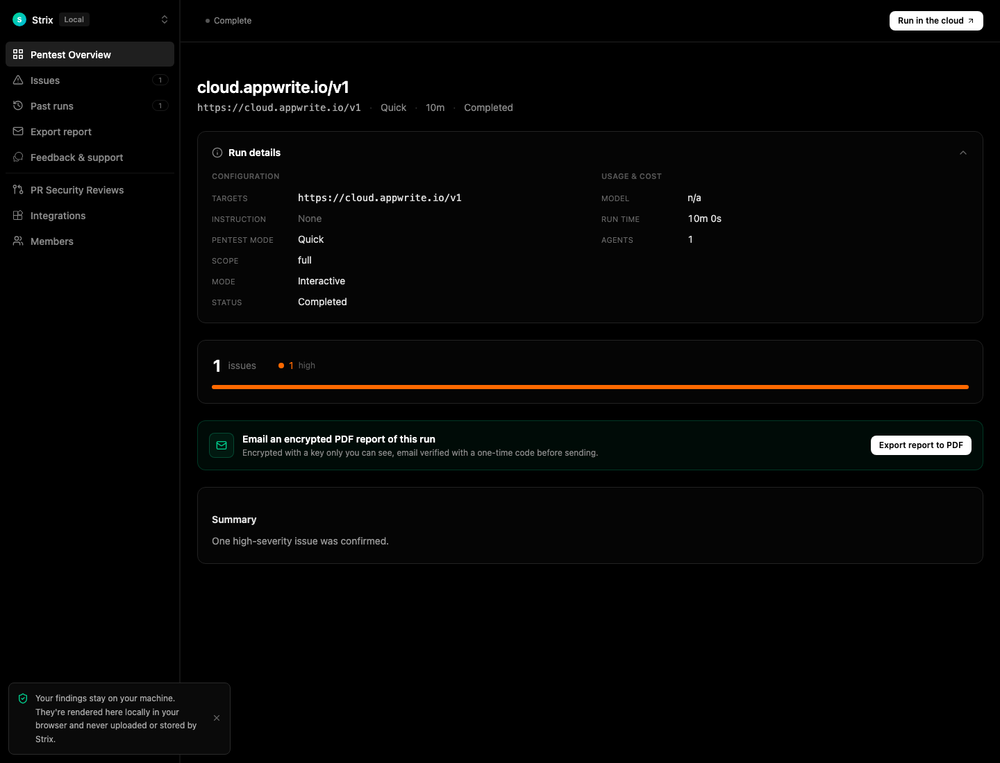

# Strix Claude Bridge

Run Strix locally through the official Claude Agent SDK using your own local Claude subscription login.

<p align="center">
  
</p>

## Why this exists

This repo is a thin bridge between Strix and the official Claude Agent SDK.

It exists so you can:
- use your existing local Claude login;
- run Strix through that login;
- avoid API-key wrappers, hosted login flows, or credential scraping.

Anything Strix-specific can be studied in the Strix repo. This README stays focused on the bridge.

## How it works

```text
You
  -> strix-claude-bridge
     -> Claude Agent SDK
     -> Strix runtime
        -> strict MCP tool calls
        -> Docker sandbox
        -> reports + Strix viewer
```

## Status

Experimental, unofficial, and local-only.

- scan only targets you own or are explicitly authorized to test;
- live scans can modify files inside the mounted target, so use a disposable copy when needed;
- official Claude tooling owns login; this bridge does not read or export Claude credentials.

## Install

```bash
uv sync --extra strix --locked
```

## Use

### 1. Check your Claude login

```bash
claude auth status --json | jq '{loggedIn, authMethod, apiProvider, subscriptionType}'
```

### 2. Run Strix

Against a live target:

```bash
uv run --extra strix strix-claude-bridge scan \
  --target https://your-authorized-target.example
```

Against a local codebase:

```bash
uv run --extra strix strix-claude-bridge scan \
  --target /path/to/your/codebase
```

### 3. Open the latest run in the Strix viewer

```bash
uv run --extra strix strix-claude-bridge view
```

## Output

Each run writes artifacts under `strix_runs/<run>/`, including:

```text
penetration_test_report.md
findings.sarif
vulnerabilities.json
vulnerabilities.csv
.state/claude-bridge/
```

## Docs

- [Live verification](docs/live-verification.md)
- [Security](docs/security.md)
- [Implementation status](docs/implementation-status.md)

---

Local bridge only. Authorized targets only.
