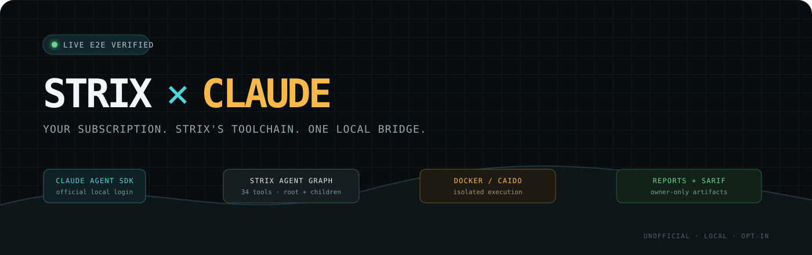
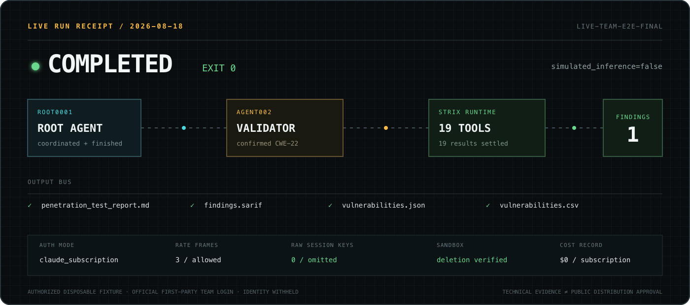
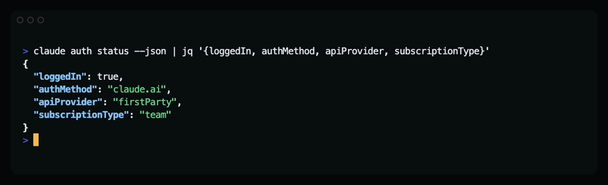
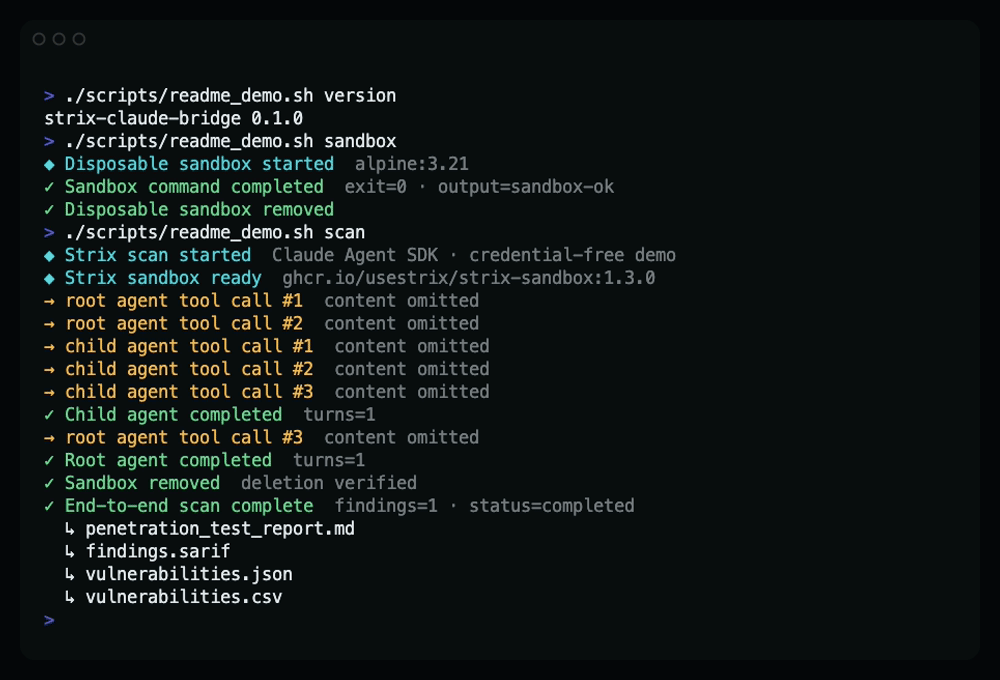

<p align="center">
  
</p>

<p align="center">
  <strong>An unofficial, opt-in Strix companion backend for the official Claude Agent SDK.</strong><br>
  Run Strix locally with your own eligible Claude subscription login—no API key, credential extraction, hosted login, or subscription proxy.
</p>

<p align="center">
  
  
  
  
  
</p>

> [!CAUTION]
> **Public release is blocked without prior Anthropic approval.** The official [Agent SDK overview](https://code.claude.com/docs/en/agent-sdk/overview) says Anthropic does not allow third-party developers to offer Claude.ai login or rate limits for products—including Agent SDK agents—unless previously approved, and directs developers to API-key authentication instead. This repository is a private technical preview; see the [policy gate](docs/policy-gate.md).
>
> This is an **unofficial experimental companion**, not an Anthropic or Strix product and not yet a native backend inside the upstream `strix` CLI. Every target must be owned or explicitly authorized. Technical evidence below is not permission to distribute subscription-backed functionality.

## What just worked live

On 2026-08-18, the bridge completed a real Team-backed scan against the bundled authorized fixture:

| Live path | Observed result |
|---|---|
| Official authentication | First-party `claude.ai` login; Team subscription |
| Agent topology | Root agent created and coordinated one child agent |
| Strix execution | 19 live model-selected tool calls through real Strix MCP seams |
| Sandbox | Production Strix Docker/Caido bundle; cleanup verified |
| Finding | One evidence-backed CWE-22 finding |
| Outputs | Markdown report, JSON, CSV, SARIF 2.1.0, usage and agent graph |
| Privacy | No raw provider session ID in default JSONL or durable state |
| Terminal result | `completed=true`, `simulated_inference=false`, exit `0` |

The live run also exposed two integration bugs—an allowed rate-status event was treated as terminal, and mailbox interruption returned `aborted_tools`. Both now have regression tests and bounded same-process recovery. Exact evidence and limits are in [Live verification](docs/live-verification.md).

<p align="center">
  
</p>

<details>
<summary>Sanitized official Team login check</summary>
<br>
<p align="center">
  
</p>
</details>

## See the pipeline run

The recording below is generated from the real credential-free end-to-end demo: bridge CLI → Strix root/child graph → production Strix sandbox → finding → reports/SARIF → verified cleanup. Only inference is scripted in this recording; the same combined path has also passed live with the Team login described above.

<p align="center">
  
</p>

<p align="center"><a href="docs/assets/e2e-demo.gif">▶ Watch the animated terminal recording</a></p>

Reproduce it locally:

```bash
./scripts/readme_demo.sh version
./scripts/readme_demo.sh sandbox
./scripts/readme_demo.sh scan
```

## Why this bridge exists

Stock Strix routes models through OpenAI Agents/LiteLLM. Claude Agent SDK owns its own provider-native agent loop, authentication, streaming and sessions, so treating it as another LiteLLM model would create nested control loops and broken state.

This project keeps the boundary honest:

```text
Claude Agent SDK     owns inference, streaming and provider sessions
        ↓ strict in-process MCP
Strix agent graph    owns prompts, tools, coordination and findings
        ↓ bound host authority
Docker / Caido       owns security-test execution
        ↓
Reports              Markdown · JSON · CSV · SARIF
```

The existing Strix providers remain untouched. Each root or child gets an independent `ClaudeSDKClient`; 33 tools are available to each role, with `finish_scan` root-only and `agent_finish` child-only.

## Quick start

### 1. Requirements

- Python 3.12+
- [`uv`](https://docs.astral.sh/uv/)
- Docker
- Official Claude tooling with an eligible local subscription login

Pinned runtime: Strix `1.5.3`, Claude Agent SDK `0.2.139`, OpenAI Agents `0.19.0`, Strix study commit `8ede419dccf6742aa0e0c4fe3e7faf11c471ff9a`.

```bash
uv sync --extra test --extra strix --locked
uv run strix-claude-bridge --help
```

### 2. Check official login without exposing identity fields

```bash
claude auth status --json \
  | jq '{loggedIn, authMethod, apiProvider, subscriptionType}'
```

The bridge never reads Claude credential files. Official tooling owns login.

### 3. Run a harmless live SDK/MCP probe

```bash
unset ANTHROPIC_API_KEY ANTHROPIC_AUTH_TOKEN ANTHROPIC_BASE_URL \
  ANTHROPIC_CUSTOM_HEADERS AWS_BEARER_TOKEN_BEDROCK \
  CLAUDE_CODE_USE_BEDROCK CLAUDE_CODE_USE_VERTEX CLAUDE_CODE_USE_FOUNDRY

uv run strix-claude-bridge live-probe --authorized-use \
  --image alpine:3.21 \
  --prompt 'Use sandbox_exec once to run: echo sdk-sandbox-ok. Then stop.'
```

### 4. Run a live Strix scan

> [!WARNING]
> Strix exposes shell and `apply_patch` capabilities inside its sandbox. A bind-mounted local target can be modified. Scan a **disposable clone, worktree or copy**, never your only working tree.

```bash
cp -R ./authorized-test-app /tmp/authorized-test-app-scan

uv run --extra strix strix-claude-bridge scan \
  --experimental --authorized-use \
  --target /tmp/authorized-test-app-scan \
  --scan-mode quick \
  --instruction 'Assess only this authorized disposable copy' \
  --run-name authorized-claude-scan \
  --max-turns 100 \
  --max-runtime 3600 \
  --max-concurrent-agents 2 \
  --max-agents 8 \
  --max-tool-calls-per-agent 500
```

Live execution sends prompts and model-selected source, request, mailbox, tool-result and finding content to Anthropic. Obtain the target owner's approval for that transfer and review current provider terms and retention rules.

## No login magic—and no credential games

The bridge deliberately does **not**:

- scrape or replay Claude OAuth tokens;
- mount Claude credentials into Docker;
- implement a hosted login;
- pool users or proxy one person's subscription to another;
- silently fall back to API-key, Bedrock, Vertex or Foundry billing;
- claim subscription spend as API dollars.

Before target preparation or Docker startup, subscription mode rejects known API/custom endpoint/cloud selectors. Their values are never printed or persisted.

## Outputs

Every successful scan writes owner-only artifacts beneath `strix_runs/<run>/`:

```text
penetration_test_report.md
findings.sarif
vulnerabilities.json
vulnerabilities.csv
vulnerabilities/vuln-*.md
run.json
.state/claude-bridge/
├── agent-graph.json
├── claude-events.jsonl
├── claude-sessions.json
├── claude-usage.json
└── tool-journal.json
```

Durable bridge state contains metadata and hashes, not raw tool arguments/results, mailbox text or provider session IDs. Report files intentionally contain security content.

## Safety controls

- Explicit `--experimental --authorized-use` gate for live scans.
- Root/child agent, concurrency, turn, runtime, per-turn timeout and tool-call limits.
- Strict SDK-created MCP only; Claude built-ins, settings, skills and external MCP are disabled.
- Host-bound agent identity, sandbox, coordinator, report state and paths.
- Metadata-only JSONL by default; sensitive payloads require explicit opt-in.
- Owner-only `0700` directories and `0600` files.
- SDK disconnect and verified Docker cleanup on success, error and cancellation.
- Process-restart resume remains disabled rather than risking duplicate side effects.

The production Strix Docker/Caido runtime is a pentesting environment, **not** a hostile-code or multi-tenant security boundary.

## Credential-free demo

Use this before any live inference:

```bash
DEMO_DIR="$(mktemp -d)"
cp -R ./fixtures/vulnerable_app "$DEMO_DIR/vulnerable_app"

uv run --extra strix strix-claude-bridge scan \
  --experimental --dry-run \
  --target "$DEMO_DIR/vulnerable_app" \
  --scan-mode quick \
  --run-name "claude-multi-agent-dry-run-$(date +%s)" \
  --max-turns 10 \
  --max-runtime 120 \
  --max-concurrent-agents 2
```

This runs real Strix coordination, Docker, MCP tools, findings and reports with scripted inference and no authentication/network inference.

Credential-free Docker-only probe:

```bash
uv run strix-claude-bridge sandbox-probe \
  --image alpine:3.21 \
  --command 'printf "sandbox-ok\n"'
```

## Current scope

**Verified:** active Team login, official SDK query, strict MCP, live root/child Strix scan, Docker execution, findings, report/SARIF generation, metadata-only session handling, concurrency two, cancellation, tool timeout and cleanup.

**Still experimental or external:** Anthropic third-party subscription policy approval, bridge-side organization enforcement, arbitrary-plan support beyond the tested Team account, maximum quota/capacity behavior, native upstream Strix backend selection, process-restart resume, full Go TUI/SQLite parity and five-platform standalone packaging.

## Validate the project

```bash
uv lock --check
uv sync --extra test --extra strix --locked
uv run ruff format --check .
uv run ruff check .
uv run pytest -m 'not docker'
STRIX_BRIDGE_RUN_DOCKER_TESTS=1 uv run pytest -m docker
uv build
```

No automated test performs live inference. Never put subscription-backed live execution in shared CI.

## Documentation

- [Anthropic authentication policy gate](docs/policy-gate.md)
- [Live Claude Team verification](docs/live-verification.md)
- [Architecture](docs/architecture.md)
- [Ownership boundaries](docs/ownership-boundaries.md)
- [Implementation status](docs/implementation-status.md)
- [Tool parity and generated inventory](docs/tool-parity.md)
- [Events, sessions and disabled resume](docs/events-sessions-resume.md)
- [Security and privacy](docs/security.md)
- [Operations and incident response](docs/operations.md)
- [Compatibility evidence](COMPATIBILITY.md)
- [Architecture decisions](docs/decisions/README.md)

---

<p align="center">
  <strong>Unofficial. Local. Opt-in. Authorized targets only.</strong><br>
  No LICENSE is included yet; nothing has been published or released by this repository.
</p>
